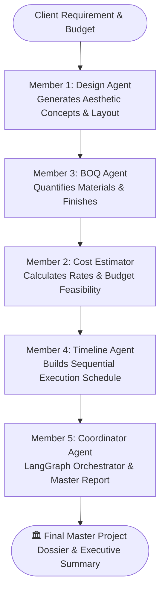

# InterioOS AI — Multi-Agent Interior Design System

**InterioOS AI** is an intelligent multi-agent platform designed to assist interior designers from concept to execution. Designers provide high-level project requirements (e.g., *"Design a modern bedroom for a client within a budget of Rs. 8 lakh"*), and specialized AI agents collaboratively generate concepts, estimate material costs, generate Bills of Quantities (BOQ), calculate project budgets, manage execution timelines, and produce executive project dossiers.

---

## 👥 Multi-Agent Architecture & Team Roles



---

### 👥 Member 1 — Design Agent (Concept Generation)
- **Node**: `design_agent_node` (`design_agent.py`)
- **LLM**: Groq Ultra-Fast Inference (`openai/gpt-oss-120b`)
- **Output**: `state["design_concept"]` (Themes, spatial zoning, color palettes, lighting & furniture directions).

---

### 👥 Member 3 — BOQ Agent (Bill of Quantities / Material List)
- **Node**: `boq_agent_node` (`agents/boq_agent.py`)
- **LLM**: Anthropic Claude (`claude-3-5-sonnet`) / Groq fallback
- **Prompt**: *"is design ke liye materials ki list banao (paint, tiles, furniture) with quantity"*
- **Output**: `state["boq_markdown"]` (Markdown table) and `state["items"]` (Structured JSON list).

---

### 👥 Member 2 — Cost Estimator (Financial & Budget Feasibility)
- **Node**: `cost_agent` (`agents/cost_agent.py`)
- **Engine**: Pricing Engine (`data/pricing_data.csv`) + Groq Analysis
- **Output**: `state["cost"]` (Total estimated cost, client budget comparison, remaining surplus/deficit, itemized rates).

---

### 👥 Member 4 — Timeline Agent (Project Execution Schedule)
- **Node**: `timeline_agent_node` (`agents/timeline_agent.py`)
- **LLM**: Anthropic Claude / Groq fallback
- **Prompt**: *"is project ka simple timeline banao — kaunsa kaam kab hoga"*
- **Output**: `state["timeline_markdown"]`, `state["estimated_duration"]`, `state["timeline_status"]`.

---

### 👥 Member 5 — Coordinator Agent + LangGraph Orchestration (Lead Role)
- **Node**: `coordinator_agent_node` (`agents/coordinator_agent.py`)
- **Orchestration**: Full 5-Agent LangGraph StateGraph (`build_full_pipeline`)
- **Responsibilities**:
  1. **Output Aggregation**: Sabhi 4 agents ka output collect karna (`design_concept`, `boq_markdown`, `cost`, `timeline_markdown`).
  2. **Executive Synthesis**: Multi-agent deliverables ko analyze karke high-level executive review aur risk management strategy tayyar karna.
  3. **Master Report Generation**: Ek comprehensive, structured **Final Master Project Dossier** banana aur `state["final_report"]` mein save karna.
  4. **LangGraph Pipeline Wiring**: `START -> design_agent -> boq_agent -> cost_agent -> timeline_agent -> coordinator_agent -> END` edges connect karna.

---

## 🛠️ Tech Stack
- **Language**: Python 3.10+
- **Frontend / UI**: Streamlit
- **Agent Orchestration**: LangGraph (`StateGraph`, `START`, `END`)
- **LLM Engines**: Anthropic Claude (`claude-3-5-sonnet`) & Groq (`openai/gpt-oss-120b`)
- **Data & Tables**: Pandas, CSV

---

## 📁 Project Structure

```text
InterioOS/
├── agents/
│   ├── __init__.py               # Agent package exports
│   ├── boq_agent.py              # Member 3: BOQ Agent (Claude/Groq)
│   ├── cost_agent.py             # Member 2: Cost Estimator (Pricing Data)
│   ├── timeline_agent.py         # Member 4: Timeline Agent (Claude/Groq)
│   └── coordinator_agent.py      # Member 5: Coordinator & Pipeline Orchestrator
├── data/
│   └── pricing_data.csv          # Unit rates for finishes & furniture
├── design_agent.py               # Member 1: Design Agent (LangGraph + Groq)
├── app.py                        # Streamlit UI with 1-Click 5-Agent Pipeline & Master Report
├── test_coordinator.py          # Member 5 Coordinator Agent standalone test
├── test_langgraph_pipeline.py    # Complete 5-Agent end-to-end pipeline test
├── test_timeline.py              # Member 4 Timeline Agent test
├── test_boq.py                   # Member 3 BOQ Agent test
├── test_cost.py                  # Member 2 Cost Agent test
├── test_groq.py                  # Groq connectivity test
├── requirements.txt              # Dependencies
├── .env.example                  # Environment template
└── README.md                     # Documentation
```

---

## 🚀 Getting Started

### 1. Configure Environment Variables
Create or edit `.env` in the root directory:
```env
# Groq (Fast Inference)
GROQ_API_KEY=your_groq_api_key_here
GROQ_MODEL=openai/gpt-oss-120b

# Anthropic Claude (Member 3 BOQ, Member 4 Timeline & Member 5 Coordinator)
ANTHROPIC_API_KEY=your_anthropic_api_key_here
ANTHROPIC_MODEL=claude-3-5-sonnet-20241022
```

### 2. Run with Streamlit
Launch the interactive web interface:
```bash
streamlit run app.py
```

### 3. Run Tests from Terminal (CLI)
```bash
# Test Member 5 Coordinator Agent
python test_coordinator.py

# Test Full 5-Agent Multi-Agent LangGraph Pipeline (1 -> 3 -> 2 -> 4 -> 5)
python test_langgraph_pipeline.py

# Test Member 4 Timeline Agent
python test_timeline.py

# Test Member 3 BOQ Agent
python test_boq.py

# Test Member 2 Cost Agent
python test_cost.py
```

---

## 🔄 Shared LangGraph State Schema

```python
class InterioOSState(TypedDict, total=False):
    user_requirement: str          # Input client requirement
    budget: Optional[str]          # Project budget (e.g. 'Rs. 8 Lakh')
    room_type: Optional[str]       # Room category
    style: Optional[str]           # Aesthetic style
    model: Optional[str]           # Model used
    design_concept: Optional[str]  # Member 1 Output: Design concept
    boq_markdown: Optional[str]    # Member 3 Output: Markdown BOQ material list
    items: Optional[list]          # Member 3 Output: Structured items for cost calculation
    boq_status: Optional[str]      # Member 3 Status: 'completed' | 'failed'
    boq_engine: Optional[str]      # Member 3 Engine used
    cost: Optional[Dict[str, Any]] # Member 2 Output: Cost calculation breakdown
    timeline_markdown: Optional[str] # Member 4 Output: Project execution schedule
    estimated_duration: Optional[str] # Member 4 Output: Overall project duration
    timeline_status: Optional[str] # Member 4 Status: 'completed' | 'failed'
    timeline_engine: Optional[str] # Member 4 Engine used (Claude / Groq)
    final_report: Optional[str]    # Member 5 Output: Combined Master Project Dossier
    coordinator_status: Optional[str] # Member 5 Status: 'completed' | 'failed'
    coordinator_engine: Optional[str] # Member 5 Engine used (Claude / Groq / Algorithmic)
    status: Optional[str]          # Workflow status
    error: Optional[str]           # Error message if any
```
